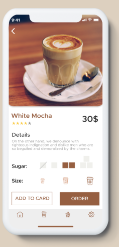
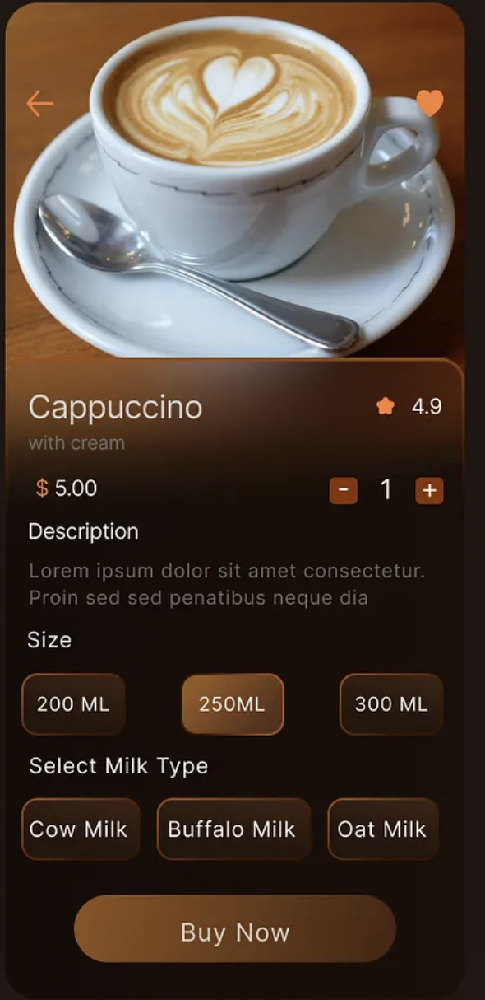
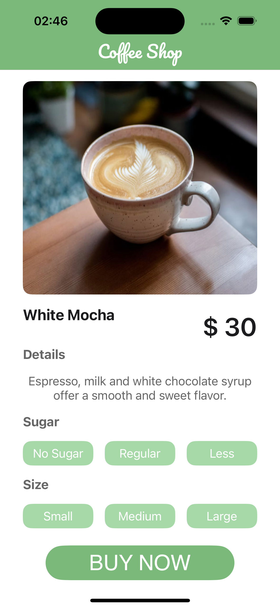
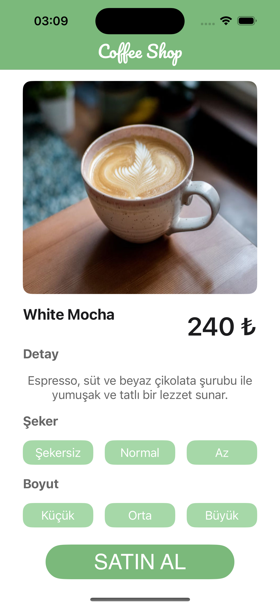
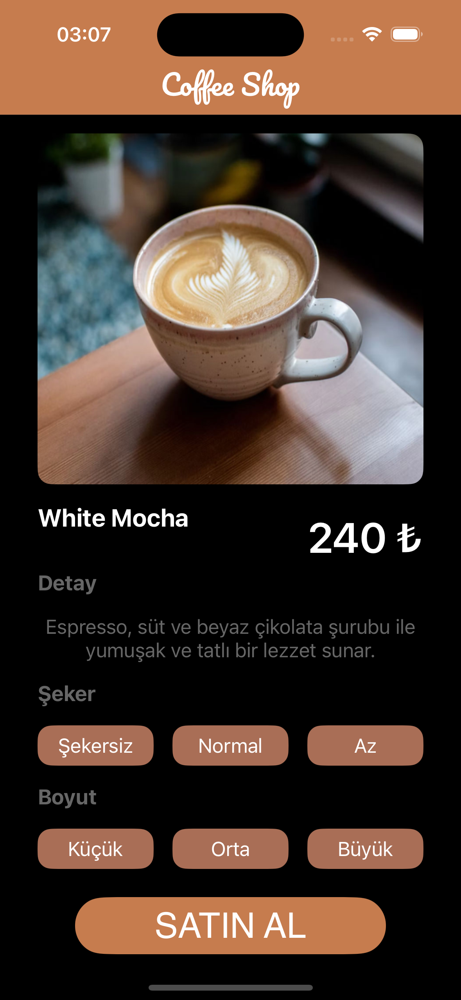

# ☕ Coffee Shop Design

This is a single-screen iOS coffee ordering app design created as part of a UI/UX improvement project. It features clean layout, dark/light mode support, localization, and custom branding.

## 🎯 Project Goals

- Recreate a coffee product screen inspired by two modern UI designs
- Apply Auto Layout and Stack Views effectively
- Add support for both Light and Dark modes
- Enable localization (English & Turkish)
- Customize app icon, app name, and typography

---

## 📌 Inspiration Sources

- [UI8 Coffee Mix UI Kit](https://ui8.net/abdulazizalbadawi/products/coffee-mix-ui-kit?rel=timer)
- [Dribbble Coffee Shop Design](https://dribbble.com/shots/23467241-Coffee-Shop-App-Design)
### 🎨 Reference Designs

  
  

---

## 🖼️ Screenshots

### 🌞 English UI

  
  

### 🌙 Turkish UI

  
  

---

## 🔧 Features

- [x] Custom Font: Pacifico
- [x] Dynamic Layout with Stack Views
- [x] Fully localized strings (EN & TR)
- [x] Adaptive color palette for light and dark mode
- [x] Custom app icon and display name

---

## 💻 Tech Specs

- Xcode 15+
- iOS 18.2+
- UIKit with Storyboard
- No third-party libraries used

---

## 🙋‍♀️ Author

Made with 💚 by [@ecekursun](https://github.com/ecekursun)
